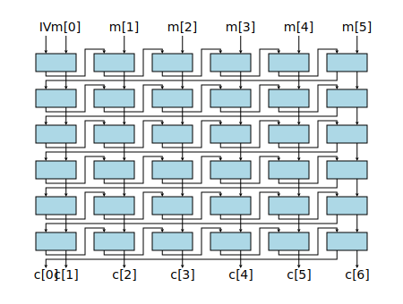

# KeyWrap (NIST SP 800 38f)

# Description

NIST SP 800 38f describes three keywrap primitives (KW, KWP and TKW). The three
primitives are related in that they use the same underlying construction for a
strong pseudorandom permutation. KW and KWP use AES, TKW uses DES. The input
size of KW and TKW are limited to a multiple of 8 (rsp 4) bytes, KWP adds a
padding so that arbitrary length inputs can be processed.

KW is also defined by [[RFC 3394]](https://tools.ietf.org/html/rfc3394). KWP is
also defined by [[RFC 5649]](https://tools.ietf.org/html/rfc5649). TKW is a key
wrap primitive that uses TripleDES instead of AES.

All the key wrap primitives use an underlying permutation (called W by NIST),
with a structure shown in the diagram below. The primitive consists of 6 rounds,
where in each round consecutive an IV and consecutive semiblocks are mixed
together using AES (rsp. TripleDES) as block cipher. The design goal appears to
be that this permutation is strong pseudorandom. The authors of RFC 3394 speak
of an "ideal pseudorandom permutation" without a precise definition.

{style="display:block;margin:auto"}

# Ambiguities

There are some minor differences between NIST SP 800 38f and the RFCs.
NIST does not define a KWP when the wrapped key is 64-bits long. RFC 3394
specifies in Section 2, that the input for the key wrap algorithm must be at
least two blocks and otherwise the constant field and key are simply encrypted
with ECB as a single block.
Other references are more clear about this. E.g.
https://www.w3.org/TR/2002/REC-xmlenc-core-20021210/Overview.html#kw-aes128
(Though the latest version https://www.w3.org/TR/xmlenc-core/
simply refers to RFC 3394).

# Padding oracles (KWP)

Keys wrapped with KWP are padded before the wrapping. The padding of a key K has
the following format

    IV || length || Key || pad,

where IV is the 4 byte constant `0xA65959A6`, length is the length of the key K
as a 4 byte bigendian byte array, pad are 0 bytes so that the length of the
padded byte array is a multiple of 8 bytes long. Unwrapping requires that the
padding is checked and used as an integrity check. The probability that a random
string has the padding above is about $$1.004\cdot 2^{-64}$$. Hence checking the
padding gives about 64 bit of security against an attacker that tries to pass
random inputs as wrapped keys.

An implementation is expected to check all the parts of the padding. If it
throws exceptions depending on which part of the padding is unexpected then
these exception leak partial information about the plaintext in form of a
padding oracle. Many cryptographic primitives are susceptible to attacks if
padding oracles are present. So one question is whether this is the case here
too.

An analysis of cryptographic primitives based on strong pseudorandom
permutations is [[BelRog00]](bib.md#belrog00).
Theorem 2 implies that checking redundancy in the
plaintext gives an integrity check is correct, i.e. any constant part in the
plaintext is useful as integrity check.

Another property of strong pseudorandom permutations is that the decryption
D(c') of a modified ciphertext c' does not reveal anything useful about D(c). So
instead of wondering whether some padding information or side channel is useful
for an attacker one can look at the situation where the attacker receives all of
D(c') for any modified c'. Strong pseudorandomness implies that this does not
help to find D(c). A padding oracle leaks of course less information than the
full plaintext D(c'). Hence if the full plaintext is not useful for an attack
then a padding oracle is not helpful either.

So basing a key wrap primitive on a potential strong pseudorandom permutation is
a robust approach. Its properties would rule out padding attacks. However, KWP
is breaking the strong pseudorandom property. While it uses KW for most of the
wrappings and unwrappings, it uses a single AES encryption and decryption for
plaintexts of size 8 or smaller. If one tries the same argumentation as above,
i.e. allow an attacker to just access D(c') for all modified ciphertexts c' then
there is an attack, since the attacker can simply call the decryption oracle
multiple times with 16 byte ciphertexts.

In practice an attacker should only learn partial information about the
decrypted ciphertext and hence the attack above is theoretical. But it is still
quite puzzling why an RFC would abandon a nice property to encrypt key of sizes
(64-bit or less) that shouldn't be used in the first place.

NIST SP 800 38f allows to restrict the input sizes to key sizes actually used.
Today nobody should use 8 byte keys for anything. Hence, it would make sense if
any implementation of KWP would disallow keys of size 8 or smaller and hence
wrappings of size 16 byte.

## Cryptanalysis

### Forgery attack

NIST SP 800 38f describes a forgery attack by Ferguson. The attack uses a known
wrapping of a message that is n semiblocks long. Ferguson observed that there it
is possible that modifying the last block of the ciphertext does not propagate
to first block of the decryption. In particular, if there exists blocks
$$1\leq i_1\leq i_2\leq i_3\leq i_4\leq i_5\leq i_6\leq n,$$ such that the
decryption of block $$i_r$$ in round $$r$$ does not change the outcome of the
first half of the plaintext then decryption does not change the IV and hence the
modified ciphertext is accepted as a valid key wrapping. The probability of this
happening is approximately

$$1/720 (n / 2^h)^6,$$

where $$n$$ is the number of semiblocks of the message and $$h$$ is the number
of bits of a semiblock (i.e. $$h=64$$ for AES). This probability becomes
significant if $$n$$ is large.

### Distinguishing attack

The forgery attack by
Ferguson can also be used for a distinguishing attack. The basic goal of the
distinguishing attack is to show that the underlying construction can be
distinguished from a random permutation. The attack is a chosen plaintext
attack. The attacker choses small integers $$k,p$$ and a large number $$n$$.
The chosen plaintexts are chosen as

    k constant semiblocks || p random semiblocks || n constant semiblocks

The observation as above is that it is possible that for two inputs the
difference in the $$k$$ random semiblocks do not change the entire ciphertext.
In particular, if there exists blocks $$k+p\leq i_1\leq i_2\leq i_3\leq i_4\leq
i_5\leq n + k + p,$$ such that the encryption of block $$i_r$$ in round $$r$$
does not change the second half to the result then the semiblocks $$2\ldots
k+1$$ of the ciphertexts of the two inputs will be the same. This time
collisions only need to happen in 5 rounds, and the probability of this
occurring is larger, i.e. approximately

$$1/120 (n / 2^h)^5.$$

Additionally this is now a collision attack. If t messages of the form above are
wrapped then the probability of 2 of them having the same semiblocks $$2\ldots
k+1$$ is about

$$1/240 (n / 2^h)^5 t^2.$$

This probability is significant if $$n$$ is large, especially if n is close to
$$2^h$$. TKW is the weakest proposal here, because of the small block size of
TripleDES. For the maximal allowed input size of $$2^{28}$$ semiblocks an
attacker would need about $$2^{14}$$ chosen message for a distinguishing attack.
KW and KWP use AES. Because of the larger block size of 128 bits we have
$$h=64$$ here. Hence a similar attack requires a lot more chosen plaintexts or
much longer plaintexts. E.g. for $$n\leq 2^{32}$$ an attack would require more
than $$2^{80}$$ chosen plaintexts, and hence is not feasible.

For comparison, most encryption primitives based on AES suffer from a birthday
attack after significantly less encryptions and in many cases the effect of such
an attack is much more devastating. E.g. AES-GCM with random 96-bit IVs likely
leaks the authentication key after $$2^{48}$$ encryptions. Extending the attack
A distinguishing attack as the one described above is not a huge threat. By
itself it does not leak a lot of information. So an open question is whether the
distinguishing attack can be extended to a more serious attack. An attacker
learns from a collision obtained from a distinguishing attack two partial inputs
that produce a collision in the first round. Can this be used somehow?

## Testing

Wycheproof has test vectors for KW and KWP (TripleDES variants are ignored). The
main focus is on correct wrapping and unwrapping. I.e. the tests assume that the
padding of KWP is fully checked: invalid lengths, incorrect IVs or non-zero
padding are all rejected. implementations of KW do not wrap messages of size 0,
8 or any length not a multiple of 8. For longer inputs the internal counter can
overflow. Implementations are expected to implement this correctly or reject
longer inputs. Currently the tests do not fail when a padding oracle is present,
since such oracles are likely harmless.

